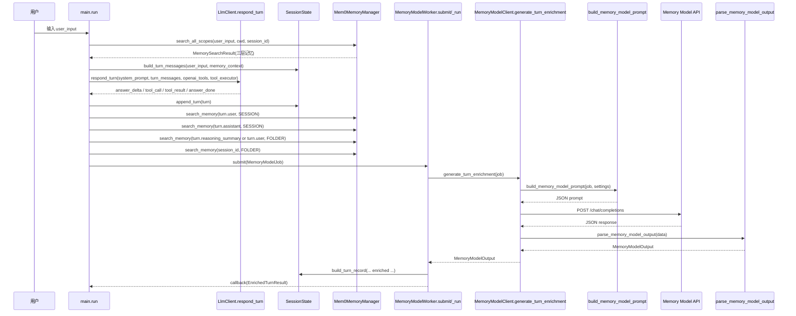
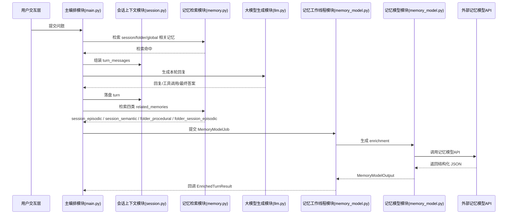
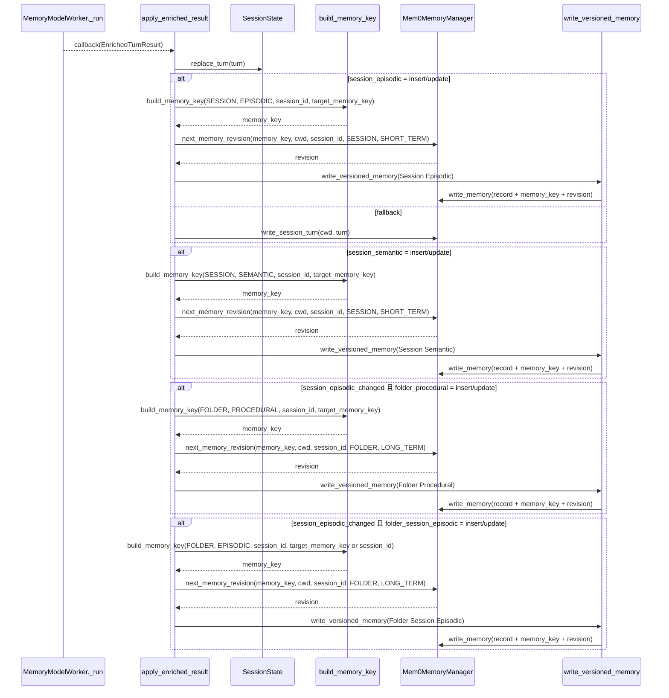
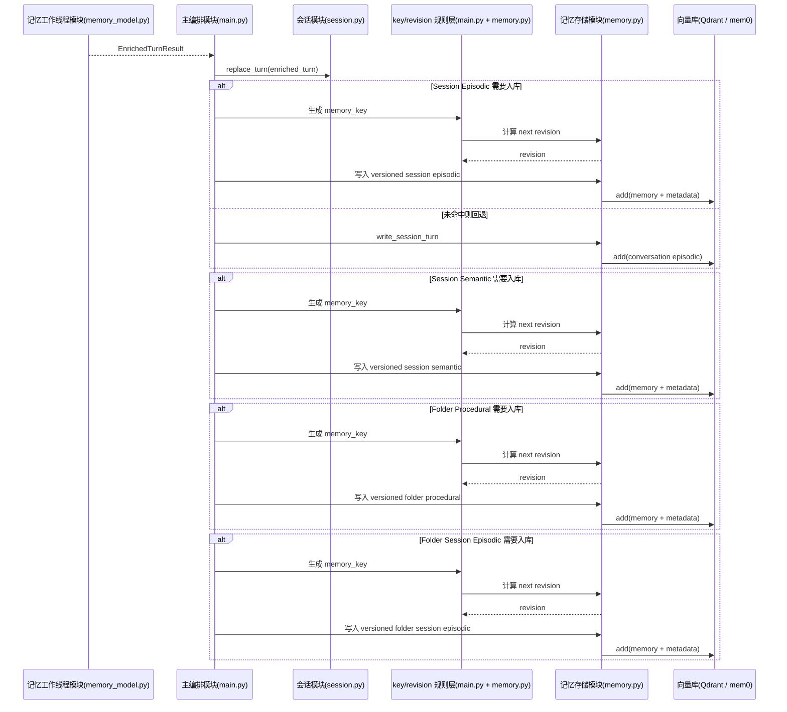

# 记忆模型真实时序图

## 一、记忆生成流程时序图（按代码函数）

```mermaid
sequenceDiagram
    participant User as 用户
    participant MainRun as main.run
    participant LLM as LlmClient.respond_turn
    participant Session as SessionState
    participant Memory as Mem0MemoryManager
    participant Worker as MemoryModelWorker.submit/_run
    participant MMClient as MemoryModelClient.generate_turn_enrichment
    participant Prompt as build_memory_model_prompt
    participant API as Memory Model API
    participant Parser as parse_memory_model_output

    User->>MainRun: 输入 user_input
    MainRun->>Memory: search_all_scopes(user_input, cwd, session_id)
    Memory-->>MainRun: MemorySearchResult(三层记忆)
    MainRun->>Session: build_turn_messages(user_input, memory_context)
    MainRun->>LLM: respond_turn(system_prompt, turn_messages, openai_tools, tool_executor)
    LLM-->>MainRun: answer_delta / tool_call / tool_result / answer_done
    MainRun->>Session: append_turn(turn)
    MainRun->>Memory: search_memory(turn.user, SESSION)
    MainRun->>Memory: search_memory(turn.assistant, SESSION)
    MainRun->>Memory: search_memory(turn.reasoning_summary or turn.user, FOLDER)
    MainRun->>Memory: search_memory(session_id, FOLDER)
    MainRun->>Worker: submit(MemoryModelJob)
    Worker->>MMClient: generate_turn_enrichment(job)
    MMClient->>Prompt: build_memory_model_prompt(job, settings)
    Prompt-->>MMClient: JSON prompt
    MMClient->>API: POST /chat/completions
    API-->>MMClient: JSON response
    MMClient->>Parser: parse_memory_model_output(data)
    Parser-->>MMClient: MemoryModelOutput
    MMClient-->>Worker: MemoryModelOutput
    Worker->>Session: build_turn_record(... enriched ...)
    Worker-->>MainRun: callback(EnrichedTurnResult)
```

## 二、记忆生成流程时序图（按模块拆分）

```mermaid
sequenceDiagram
    participant U as 用户交互层
    participant O as 主编排模块(main.py)
    participant C as 会话上下文模块(session.py)
    participant R as 记忆检索模块(memory.py)
    participant G as 大模型生成模块(llm.py)
    participant W as 记忆工作线程模块(memory_model.py)
    participant M as 记忆模型模块(memory_model.py)
    participant A as 外部记忆模型API

    U->>O: 提交问题
    O->>R: 检索 session/folder/global 相关记忆
    R-->>O: 检索命中
    O->>C: 组装 turn_messages
    O->>G: 生成本轮回复
    G-->>O: 回复/工具调用/最终答案
    O->>C: 落盘 turn
    O->>R: 检索四类 related_memories
    R-->>O: session_episodic / session_semantic / folder_procedural / folder_session_episodic
    O->>W: 提交 MemoryModelJob
    W->>M: 生成 enrichment
    M->>A: 调用记忆模型API
    A-->>M: 返回结构化 JSON
    M-->>W: MemoryModelOutput
    W-->>O: 回调 EnrichedTurnResult
```

## 三、记忆入库流程时序图（按代码函数）

```mermaid
sequenceDiagram
    participant Worker as MemoryModelWorker._run
    participant Main as apply_enriched_result
    participant Session as SessionState
    participant Key as build_memory_key
    participant Memory as Mem0MemoryManager
    participant Write as write_versioned_memory

    Worker-->>Main: callback(EnrichedTurnResult)
    Main->>Session: replace_turn(turn)

    alt session_episodic = insert/update
        Main->>Key: build_memory_key(SESSION, EPISODIC, session_id, target_memory_key)
        Key-->>Main: memory_key
        Main->>Memory: next_memory_revision(memory_key, cwd, session_id, SESSION, SHORT_TERM)
        Memory-->>Main: revision
        Main->>Write: write_versioned_memory(Session Episodic)
        Write->>Memory: write_memory(record + memory_key + revision)
    else fallback
        Main->>Memory: write_session_turn(cwd, turn)
    end

    alt session_semantic = insert/update
        Main->>Key: build_memory_key(SESSION, SEMANTIC, session_id, target_memory_key)
        Key-->>Main: memory_key
        Main->>Memory: next_memory_revision(memory_key, cwd, session_id, SESSION, SHORT_TERM)
        Memory-->>Main: revision
        Main->>Write: write_versioned_memory(Session Semantic)
        Write->>Memory: write_memory(record + memory_key + revision)
    end

    alt session_episodic_changed 且 folder_procedural = insert/update
        Main->>Key: build_memory_key(FOLDER, PROCEDURAL, session_id, target_memory_key)
        Key-->>Main: memory_key
        Main->>Memory: next_memory_revision(memory_key, cwd, session_id, FOLDER, LONG_TERM)
        Memory-->>Main: revision
        Main->>Write: write_versioned_memory(Folder Procedural)
        Write->>Memory: write_memory(record + memory_key + revision)
    end

    alt session_episodic_changed 且 folder_session_episodic = insert/update
        Main->>Key: build_memory_key(FOLDER, EPISODIC, session_id, target_memory_key or session_id)
        Key-->>Main: memory_key
        Main->>Memory: next_memory_revision(memory_key, cwd, session_id, FOLDER, LONG_TERM)
        Memory-->>Main: revision
        Main->>Write: write_versioned_memory(Folder Session Episodic)
        Write->>Memory: write_memory(record + memory_key + revision)
    end
```

## 四、记忆入库流程时序图（按模块拆分）

```mermaid
sequenceDiagram
    participant W as 记忆工作线程模块(memory_model.py)
    participant O as 主编排模块(main.py)
    participant C as 会话模块(session.py)
    participant K as key/revision 规则层(main.py + memory.py)
    participant S as 记忆存储模块(memory.py)
    participant V as 向量库(Qdrant / mem0)

    W-->>O: EnrichedTurnResult
    O->>C: replace_turn(enriched_turn)

    alt Session Episodic 需要入库
        O->>K: 生成 memory_key
        K->>S: 计算 next revision
        S-->>K: revision
        O->>S: 写入 versioned session episodic
        S->>V: add(memory + metadata)
    else 未命中则回退
        O->>S: write_session_turn
        S->>V: add(conversation episodic)
    end

    alt Session Semantic 需要入库
        O->>K: 生成 memory_key
        K->>S: 计算 next revision
        S-->>K: revision
        O->>S: 写入 versioned session semantic
        S->>V: add(memory + metadata)
    end

    alt Folder Procedural 需要入库
        O->>K: 生成 memory_key
        K->>S: 计算 next revision
        S-->>K: revision
        O->>S: 写入 versioned folder procedural
        S->>V: add(memory + metadata)
    end

    alt Folder Session Episodic 需要入库
        O->>K: 生成 memory_key
        K->>S: 计算 next revision
        S-->>K: revision
        O->>S: 写入 versioned folder session episodic
        S->>V: add(memory + metadata)
    end
```
