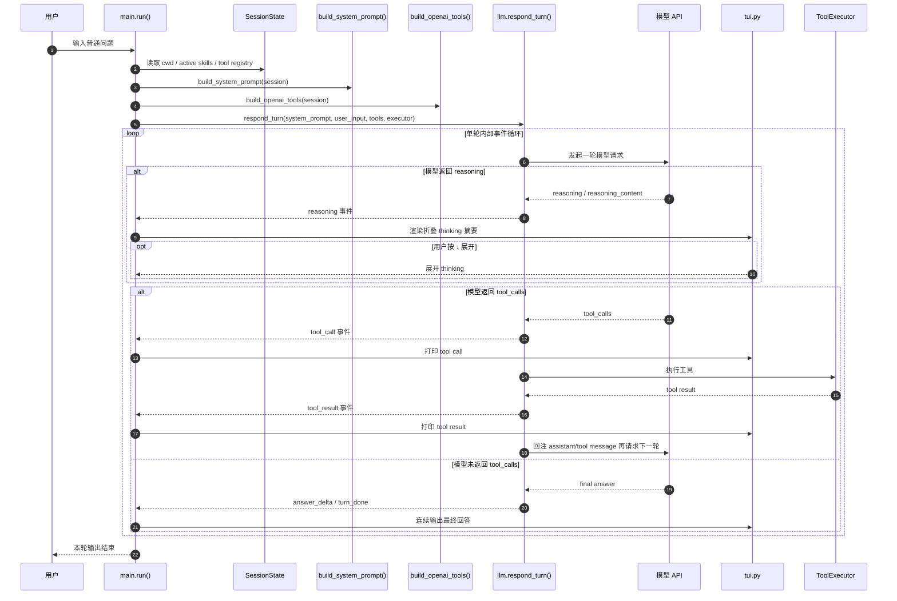
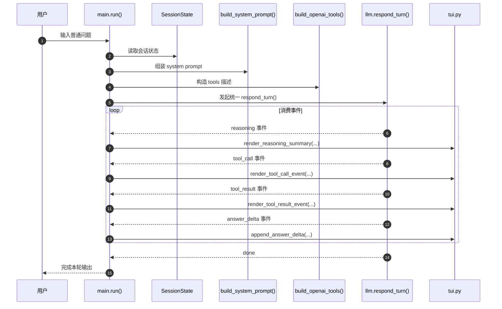
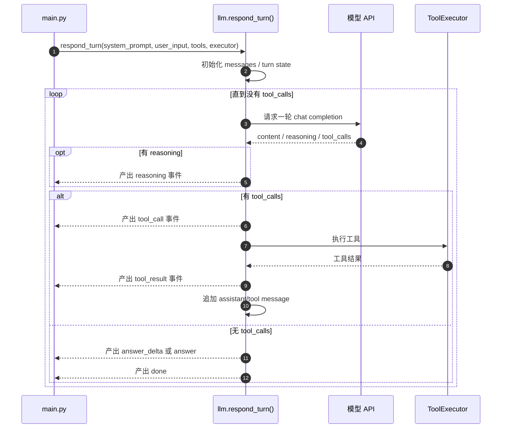
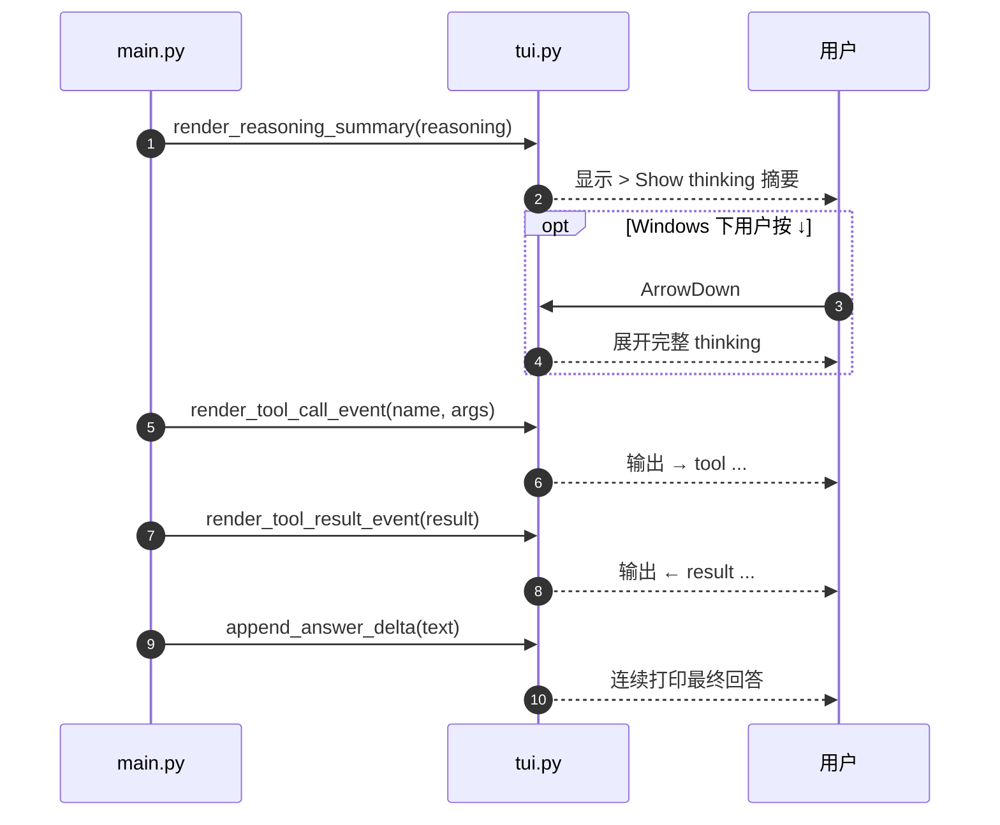
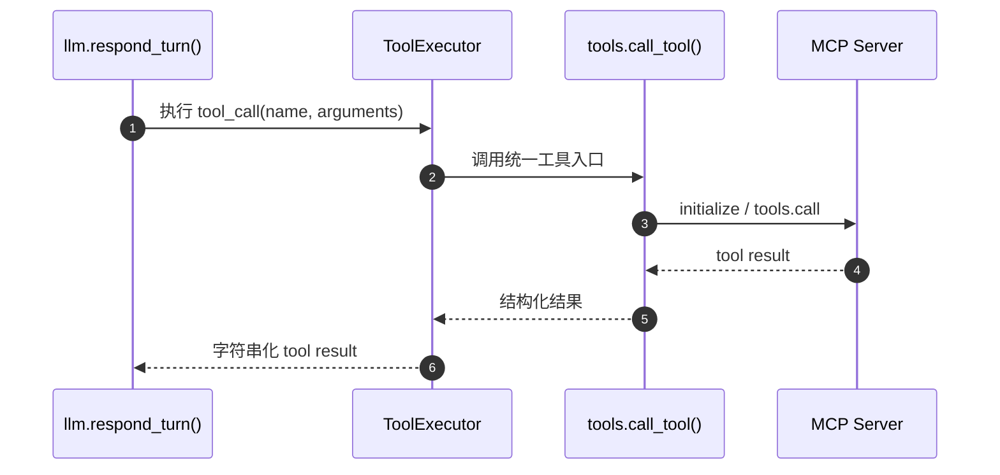

# 会话流式输出方案文档

## 一、文档目标

本文用于定义 `zhou` 当前会话输出机制的下一阶段改造方案，重点回答以下问题：

1. 为什么当前输出链路需要重构；
2. 当前 `stream_chat` 与 `chat_with_tools` 分叉模式的问题是什么；
3. 统一后的会话 loop 应该长什么样；
4. thinking、tool call、tool result、final answer 应该如何在 CLI 中显示；
5. 第一版应该先做到什么，暂时不做什么；
6. 当前代码如何渐进演进到统一的流式事件模型。

本文既面向使用者，也面向后续维护者。

---

## 二、当前实现现状

当前 `zhou` 的回复链路分为两套：

### 1. 无工具时

走：

- `llm.stream_chat(system_prompt, user_input)`

特点：

- 流式输出；
- 只处理最终文本内容；
- 不处理 tool call；
- 也没有处理 reasoning 流。

### 2. 有工具时

走：

- `llm.chat_with_tools(system_prompt, user_input, tools, tool_executor)`

特点：

- 内部有 tool loop；
- 使用非流式请求；
- 最终一次性返回 answer；
- reasoning 虽然可能被模型返回，但不会在 CLI 中展示；
- tool 调用过程也不会在 CLI 中被拆分展示。

也就是说，当前实现是：

```text
无 tools -> 流式文本回答
有 tools  -> 非流式 tool loop + 一次性最终回答
```

这说明当前系统还不是一个统一的“会话事件流”，而是两套并行逻辑。

---

## 三、当前实现的核心问题

### 1. 普通回答与工具回答是两套协议路径

当前 `main.py` 会根据 `openai_tools` 是否为空，决定走哪条调用链。

这会导致：

- `main.py` 知道太多 LLM 层细节；
- 未来新增 reasoning 流、tool 流、history、事件渲染时，需要分别兼容两套逻辑；
- 输出体验不统一。

### 2. reasoning 没有被当成一等输出事件

虽然当前代码已经兼容了：

- `reasoning_content`
- `reasoning`

但它们只是被保留在回传 message 里，并没有进入 CLI 渲染层。

### 3. tool 调用过程对用户不可见

现在用户只能看到：

- 一次性最终 answer

而看不到：

- 模型何时决定调工具；
- 调了什么工具；
- 工具结果是什么；
- 工具之后模型又如何继续推进。

### 4. 会话虽持续存在，但消息级对话 history 没有统一进入 loop

当前会话里持久存在的是：

- cwd
- active skills
- tool registry

但 LLM 的 message history 还没有作为统一状态参与后续所有请求。

---

## 四、目标形态：统一会话事件流

下一阶段目标不是继续维护两套回复模式，而是统一成一个“会话级主循环 + 单轮内部事件子循环”的架构。

可以抽象为：

```text
CLI 主会话 loop
  -> 用户输入
  -> 命令解析
  -> 普通消息进入统一 respond_turn()
  -> respond_turn() 内部再执行模型 / reasoning / tool / final answer 子循环
```

也就是：

```text
外层：一个 CLI 会话持续存在
内层：每个用户请求是一个统一的 turn loop
```

---

## 五、目标时序链路

统一后，一轮用户请求的理想时序应为：

```text
用户输入
-> 模型开始思考
-> thinking 内容流式显示
-> 模型决定是否 tool call
-> CLI 显示 tool call
-> 工具执行
-> CLI 显示 tool result
-> 模型继续思考
-> thinking 内容继续显示
-> 决定是否继续调用工具
-> 没有 tool call 后，开始最终答案流式输出
-> 结束本轮
```

这意味着一轮 turn 至少包含四类事件：

1. `reasoning`
2. `tool_call`
3. `tool_result`
4. `final_answer`

---

## 六、统一 loop 的设计原则

### 1. system prompt 与 tools 继续分层

这一点应该保留当前设计，不需要混在一起。

- `system prompt`：
  - 基础系统提示
  - active skills 拼装结果
- `tools`：
  - 单独通过 OpenAI-compatible `tools` 参数传入

也就是说：

```text
skills 决定模型怎么工作
tools  决定模型能做什么操作
```

### 2. 对用户只暴露“事件流”，不暴露内部协议分叉

CLI 不应该感知：

- 当前是普通流式
- 还是 tool loop
- 还是某轮非流式取回后再转流式

CLI 只应该消费统一事件：

- thinking
- tool
- answer

### 3. reasoning 的展示应基于模型接口显式返回字段

当前实现不应假设总能拿到完整内部思维链。

安全且稳妥的做法是：

- 展示 `reasoning_content`
- 或展示 `reasoning`
- 或未来展示模型返回的 reasoning 摘要

而不是把“不可控的内部 CoT”作为系统依赖。

### 4. 终端展示要做取舍，不照搬浏览器

浏览器中可以用：

- 折叠面板
- 卡片
- 双栏
- 富文本布局

终端中不适合完全复刻。

CLI 更适合做成：

- 分类型输出；
- thinking 和 answer 颜色区分；
- tool 作为离散事件打印；
- thinking 默认省略，只给摘要和可展开入口。

---

## 七、推荐的数据模型：事件流

建议将 `llm.py` 的输出从“字符串”升级为“事件”。

概念上可以使用以下事件类型：

```text
reasoning_delta
reasoning_done
tool_call
tool_result
answer_delta
turn_done
```

或者第一版先用更简单的统一事件结构：

```python
{"type": "reasoning_delta", "text": "..."}
{"type": "tool_call", "name": "...", "arguments": "..."}
{"type": "tool_result", "name": "...", "content": "..."}
{"type": "answer_delta", "text": "..."}
{"type": "done"}
```

这样 `main.py` 的职责就会变成：

- 消费事件；
- 选择如何渲染；
- 不再自己管理两套模式。

---

## 八、推荐的内部执行方式

第一版不必强行实现“全链路真流式”。

更稳妥的工程策略是：

### 方案：统一逻辑 loop，混合传输策略

#### 阶段 A：模型决策轮

内部可以先用非流式请求，拿回：

- `reasoning_content`
- `reasoning`
- `content`
- `tool_calls`

#### 阶段 B：若存在 tool call

则：

- 显示 tool call 事件；
- 执行工具；
- 显示 tool result 事件；
- 把 tool message 回注模型；
- 继续下一轮。

#### 阶段 C：若不存在 tool call

则：

- 视为最终回答轮；
- 第一版可直接输出非流式 answer；
- 第二版可升级为最终回答流式输出。

这种模式的好处是：

- 架构先统一；
- 兼容 API 差异；
- 后面更容易升级成全 streaming。

---

## 九、CLI 的推荐表现形式

终端里建议用三种展示层级。

### 1. thinking

建议：

- 默认 dim/灰色；
- 默认折叠；
- 默认只显示一行摘要；
- 如果 reasoning 较长，则末尾显示省略号；
- 给出展开入口。

例如：

```text
> Show thinking  先读取 README，再分析最近的 git 改动...
```

展开后可变成：

```text
↓ Show thinking
  先读取 README，再分析最近的 git 改动。
  如果 README 不存在，则先检查当前目录结构。
  如果有 git 仓库，再补看 diff 和 status。
```

### 2. tool

建议：

- 单独用箭头提示；
- 作为中间离散事件打印；
- 不必做复杂折叠。

例如：

```text
→ tool filesystem.read_text_file({"path":"README.md"})
← result success, 128 lines
```

### 3. final answer

建议：

- 继续保留当前最自然的连续文本输出；
- 颜色正常；
- 不和 thinking 混排。

---

## 十、第一版推荐落地范围

为了尽快落地，建议第一版只做以下内容：

### 1. 补齐方案文档

包括：

- 当前问题
- 目标结构
- CLI 表现形态
- 演进步骤
- 第一版边界

### 2. 当前 tool loop 的 reasoning 展示

即便暂时还不是全流式，也先把当前模型返回的：

- `reasoning_content`
- `reasoning`

在 CLI 中显示出来。

### 3. 折叠 thinking 入口

第一版优先实现：

- 默认显示 `> Show thinking`
- 显示单行摘要
- 超长内容自动 `...` 省略
- 在 Windows 终端里支持“下箭头展开”
- 展开后显示完整 reasoning 文本

### 4. final answer 保持当前输出方式

第一版可暂不强制改成“全链路流式 answer + tool”。

先把：

- reasoning 的存在感
- 可展开交互
- tool loop 可观察性

建立起来。

---

## 十一、第一版暂不做的内容

第一版先不做：

1. 全 streaming 的 tool call 增量组装；
2. reasoning / answer 的复杂多栏布局；
3. 同一时间 reasoning 和 answer 并排流；
4. 可反复折叠/展开的复杂组件系统；
5. 会话历史级完整事件回放；
6. 多 turn 的 reasoning 浏览器式面板；
7. 复杂快捷键系统。

原因是：

- 当前代码还处于“字符串输出 + 单次 tool loop”阶段；
- 应先统一展示语义，再统一协议实现。

---

## 十二、第一版推荐交互细节

### 折叠状态

默认显示：

```text
> Show thinking  某一行思考摘要...
```

规则：

- 只取 reasoning 的第一段可读摘要；
- 超长时自动加 `...`；
- 不直接占满屏。

### 展开方式

Windows 终端第一版建议支持：

- 在 collapsed line 输出后，短暂监听下箭头；
- 若按下 `↓`，则直接展开完整 thinking 内容；
- 展开标题改为：

```text
↓ Show thinking
```

### 非 Windows 行为

非 Windows 终端第一版可以只显示折叠摘要，不做额外交互。

### 省略规则

建议：

- 优先取第一条非空行作为 preview；
- 如果总长度超出一行宽度或 reasoning 有多行，则追加 `...`；
- preview 只负责“提示内容存在”，不负责承载全部 reasoning。

---

## 十三、推荐的渐进改造步骤

### 阶段 1：文档 + reasoning 折叠展示

改动重点：

- `docs/会话流式输出方案文档.md`
- `src/zhou/llm.py`
- `src/zhou/main.py`
- `src/zhou/tui.py`

目标：

- tool loop 返回 answer + reasoning；
- CLI 能显示折叠 thinking；
- CLI 支持下箭头展开 reasoning 全文。

### 阶段 2：统一 `respond_turn()` 入口

改动重点：

- 合并 `stream_chat` 与 `chat_with_tools` 的主入口；
- `main.py` 不再写 `if tools then A else B`。

### 阶段 3：引入统一事件流

改动重点：

- `llm.py` 产出事件而不是纯文本；
- `main.py` 改为事件渲染器。

### 阶段 4：最终 answer 流式 + tool-aware loop

改动重点：

- 让最终 answer 尽量始终流式；
- 中间 tool round 继续内部循环；
- 形成完整统一 loop。

---

## 十四、与当前代码的映射关系

当前主要涉及：

### `main.py`

负责：

- 用户输入主循环；
- 命令分发；
- system prompt 组装；
- tool executor 注入；
- CLI 渲染触发点。

### `llm.py`

负责：

- 与模型 API 通信；
- 当前 tool loop 逻辑；
- reasoning 字段采集；
- 后续统一事件流的核心出口。

### `tui.py`

负责：

- 折叠 thinking 的终端呈现；
- 下箭头展开交互；
- 省略预览显示。

这意味着第一版实现不必一次性重构整个架构，也能先完成用户可感知的提升。

---

## 十五、第一版完成后的用户体验

第一版完成后，预期体验应为：

### 情况 A：普通无 reasoning

```text
> 你好
你好，我是 zhou。
```

### 情况 B：有 reasoning 但不展开

```text
> 帮我分析这个目录
> Show thinking  先确认目录结构，再判断是否需要读取关键文件...
这个目录当前主要包含以下几部分...
```

### 情况 C：有 reasoning 且用户按下箭头展开

```text
> 帮我分析这个目录
> Show thinking  先确认目录结构，再判断是否需要读取关键文件...
↓ Show thinking
  先确认目录结构，再判断是否需要读取关键文件。
  如果存在 README，则优先读取 README。
  如果存在配置文件，再补看入口模块。

这个目录当前主要包含以下几部分...
```

这不是浏览器式完整交互复制，而是：

> 在终端里用更轻量、更稳的方式，提供“thinking 存在感 + 可展开查看 + 最终 answer 保持清晰”的方案。

---

## 十六、总结

当前 `zhou` 的会话输出链路已经具备：

- system prompt 组装
- skills 注入
- tools 描述注入
- tool loop 执行
- 最终 answer 输出

下一阶段需要补上的，不是再加第三套分叉，而是：

```text
把 reasoning / tool / answer 都纳入统一会话事件流视角
```

第一版最合理的落地方向是：

1. 先补方案文档；
2. 先把 tool loop 中的 reasoning 展示出来；
3. 在 CLI 中实现 `> Show thinking` 折叠提示；
4. 支持 `↓` 展开完整 thinking；
5. 对长 reasoning 做 `...` 省略；
6. 保持最终 answer 清晰独立输出。

一句话总结：

> 第一版不追求浏览器式复杂交互，而是先把 `thinking` 从“内部隐含字段”提升为“终端里可观察、可展开、可省略的会话事件”。


---

## 十七、统一会话流式输出完整时序图

这一节用一张完整时序图，把“用户输入一轮请求后，系统如何在 reasoning / tool / answer 之间推进”明确下来。

### 17.1 完整时序图



### 17.2 这张图表达的核心语义

这张图有三个重点。

#### 1. 外层是 CLI 会话，内层是 turn loop

外层始终是：

- 用户输入；
- CLI 判断命令还是普通消息；
- 普通消息进入统一 `respond_turn()`。

内层才是：

- reasoning；
- tool call；
- tool result；
- final answer。

也就是说，会话不应该拆成“无 tools 一套 / 有 tools 一套”，而应该统一成：

```text
一个会话主循环
+ 一个单轮内部事件循环
```

#### 2. tool 只是 turn 内部事件，不应该改变 CLI 主协议

从 CLI 视角，用户不需要知道当前底层到底是：

- 直接流式文本；
- 非流式 tool loop；
- 还是未来的真流式 tool-aware loop。

CLI 只需要感知统一事件：

- `reasoning`
- `tool_call`
- `tool_result`
- `answer_delta`
- `done`

这能把复杂性压回 `llm.py`，而不是散落在 `main.py`。

#### 3. thinking / tool / answer 是三种不同渲染语义

虽然它们都属于同一轮 turn 的事件，但在终端里应明确分层：

- thinking：弱化、可折叠、可省略；
- tool：离散事件、强调发生了什么操作；
- answer：正常连续输出，保持可读性。

也就是说，统一的是“事件协议”，不是“视觉混排”。

---

## 十八、按模块拆分的时序

完整时序图解决的是“全局链路是什么”；按模块拆分则回答“每个模块在这条链路里到底负责什么”。

### 18.1 `main.py` 视角的时序



#### `main.py` 的职责边界

`main.py` 应负责：

- 用户输入主循环；
- `/exit`、`/skills`、`/tools` 等命令分发；
- 组装 `system prompt`；
- 注入工具描述与执行器；
- 消费统一事件并交给 `tui.py` 渲染。

`main.py` 不应继续负责：

- 手写“有 tools / 无 tools”两套分支；
- 自己理解模型响应协议；
- 自己在多轮请求之间拼装 tool loop。

一句话说：

> `main.py` 应是会话编排层和事件消费层，而不是模型协议实现层。

---

### 18.2 `llm.py` 视角的时序



#### `llm.py` 的职责边界

`llm.py` 应负责：

- 与模型 API 通信；
- 把模型返回内容标准化；
- 管理单轮内部 tool loop；
- 采集 reasoning / tool_calls / content；
- 对外产出统一事件流。

这里是整个改造的核心，因为真正需要统一的不是 UI，而是：

```text
LLM 输出语义
-> 是否调用工具
-> 如何继续下一轮
-> 何时结束本轮
```

如果这层没有统一，`main.py` 和 `tui.py` 就只能继续兼容多个分叉协议。

---

### 18.3 `tui.py` 视角的时序



#### `tui.py` 的职责边界

`tui.py` 不应负责模型控制逻辑，它只负责：

- 把 thinking 渲染成摘要 + 可展开形式；
- 把 tool call / result 渲染成稳定的中间事件；
- 把最终 answer 按正常文本输出。

所以 `tui.py` 的设计重点不是“决策”，而是“表达”：

- 什么应该弱化；
- 什么应该突出；
- 什么应该连续输出；
- 什么应该允许用户查看更多细节。

---

### 18.4 `ToolExecutor` 与工具层的时序



#### 工具层的职责边界

这一层不应关心：

- 是否显示 thinking；
- 是否最终流式输出 answer；
- 本轮 turn 是否还会继续。

它只负责：

- 接收工具名和参数；
- 执行真实工具调用；
- 返回可继续回注模型的结果。

这能保证工具层在“会话流式输出改造”里保持稳定，不被 UI 层逻辑污染。

---

### 18.5 为什么要按模块拆分时序

因为完整时序图只能告诉我们：

- 整体会怎么走。

但真正落地实现时，更需要回答：

- `main.py` 应删掉哪些分支；
- `llm.py` 应新增什么统一出口；
- `tui.py` 应承接哪些事件；
- 工具层哪些部分完全不用动。

所以按模块拆分后，改造边界会更清楚：

#### 最值得优先改的

1. `llm.py`：统一 turn loop 输出语义；
2. `main.py`：改成事件消费模型；
3. `tui.py`：承接 reasoning / tool / answer 三类渲染。

#### 可以尽量少动的

1. `skills.py`：仍只负责 system prompt 片段；
2. `session.py`：仍只负责会话状态；
3. `tools.py`：仍只负责发现、描述、执行工具。

这也是为什么这份方案里一直强调：

> 第一版要统一的是“会话事件流视角”，而不是同时推翻所有底层模块。
